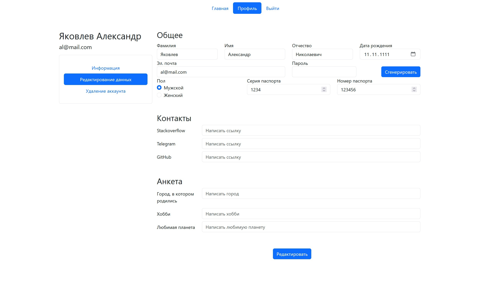

# Домашнее задание от Синергии

## Краткое описание
Проект, построенный на laravel, php, JavaScript, bootstrap и postgreSQL. Здесь есть простая авторизация пользователя и учетная запись, также есть возможность удалять и изменять данные пользователя.

## Дизайн

### Регистрация

### Вход

### Главная

### Информация о пользователе

### Изменение данных пользователя

### Удаление данных пользователя

## Что сделано
* Страница входа
* Страница регистрации
* Главная страница
* Страница профиля
* Страница выхода из учетной записи
* Добавление пользователя в базу данных postgreSQL с зашифрованным паролем (регистрация)
* Создание токена ([ReallySimpleJWT](https://github.com/RobDWaller/ReallySimpleJWT)) для пользователя со сроком на 1 час и добавление его в cookie (вход)
* Изменение данных пользователя
* Добавление контактов пользователя
* Удаление аккаунта
* Выход из учетной записи
* Валидация данных

## Что планируется добавить
* Фотография пользователя
* Кнопки "назад" (навигация)